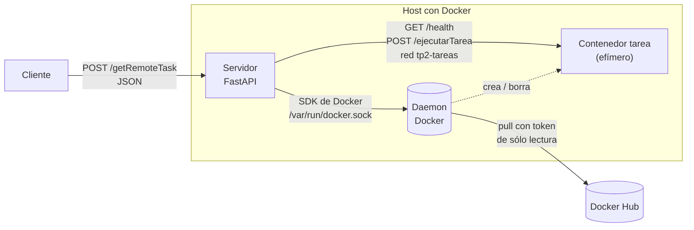
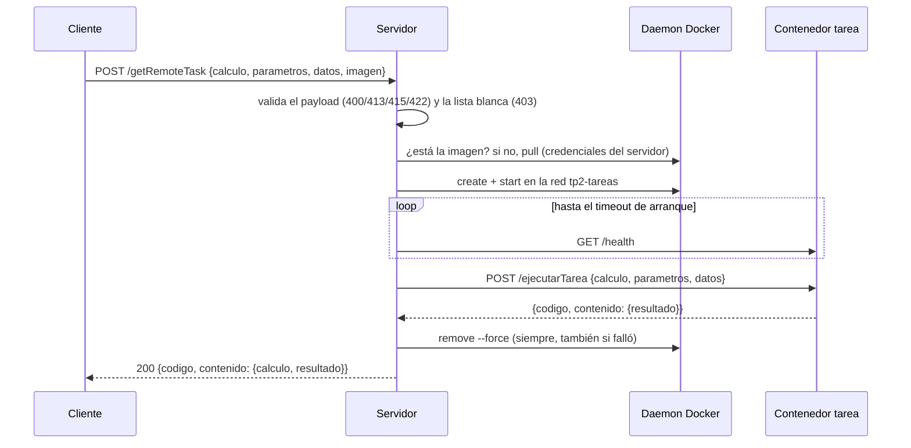
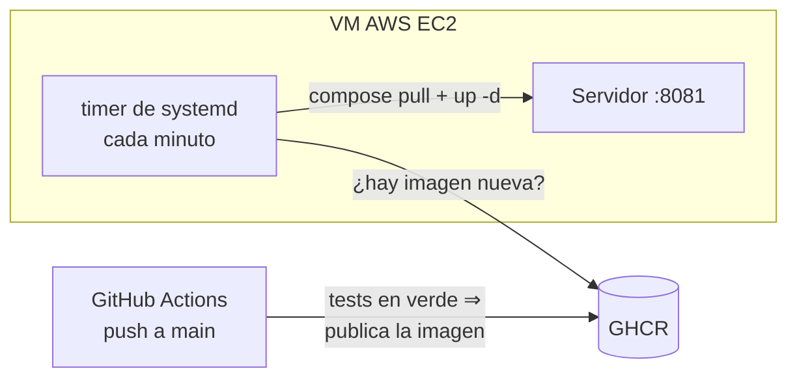

# Hit 1 — Tareas remotas en contenedores

El **cliente** manda una tarea por `POST` (JSON) al **servidor**, que levanta **temporalmente** el
**servicio tarea** como contenedor Docker, le pasa el trabajo, espera el resultado, se lo devuelve
al cliente y borra el contenedor.

| Parte | Dónde |
|---|---|
| Servidor (contenerizado) | [`servidor/`](servidor/): `getRemoteTask()` en [`app/main.py`](servidor/app/main.py), `ejecutarTareaRemota()` en [`app/lanzador.py`](servidor/app/lanzador.py) |
| Servicio tarea (imagen en Docker Hub) | [`tarea/tarea.py`](tarea/tarea.py): `ejecutarTarea()` |
| Cliente | [`cliente/cliente.py`](cliente/cliente.py) |
| Contrato de la API | [`contrato.md`](contrato.md) |

## Cómo correrlo

Requisitos: Docker con Compose v2, Linux (o WSL2) y Python 3 para el cliente (sólo biblioteca
estándar). Todo desde la carpeta `hit1/`.

```bash
cd hit1
cp .env.example .env
# Completar en .env:
#   DOCKER_GID=<salida de: stat -c %g /var/run/docker.sock>
#   TP2_IMAGENES_PERMITIDAS=cerberusdistribuido/tarea
#   TP2_REGISTRY_USUARIO=cerberusdistribuido
#   TP2_REGISTRY_TOKEN=<token de Docker Hub de sólo lectura>   (la imagen es privada)
docker compose up --build -d --wait
curl -s localhost:8080/health
```

Mandar una tarea con el cliente (la primera vez el servidor baja la imagen de Docker Hub):

```bash
python3 cliente/cliente.py suma '{"a": 3, "b": 4}' --imagen cerberusdistribuido/tarea:1.0.0
python3 cliente/cliente.py division '{"a": 1, "b": 0}' --imagen cerberusdistribuido/tarea:1.0.0   # 422
# Otro servidor: --servidor http://host:8080 (o la variable TP2_SERVIDOR). Datos adicionales: --datos '{...}'
```

O con `curl`:

```bash
curl -s -X POST localhost:8080/getRemoteTask \
  -H 'Content-Type: application/json' \
  -d '{"calculo": "suma", "parametros": {"a": 3, "b": 4}, "imagen": "cerberusdistribuido/tarea:1.0.0"}'
```

### Publicar el servicio tarea en Docker Hub

La imagen está en un repositorio **privado** de Docker Hub (`cerberusdistribuido/tarea`).

```bash
docker login                                   # con un token de escritura, no la contraseña
docker build -t cerberusdistribuido/tarea:1.0.0 tarea/
docker push cerberusdistribuido/tarea:1.0.0
```

Logs: `docker compose logs -f servidor` (consola) y el volumen `logs` (disco, archivo rotativo);
además el servidor guarda las últimas 500 líneas en memoria.

Bajar todo: `docker compose down` (con `-v` borra también los logs).

### Tests

```bash
cd hit1/servidor
python3 -m venv .venv
source .venv/bin/activate          # Windows PowerShell: .venv\Scripts\Activate.ps1
pip install -r requirements-dev.txt
python -m pytest                   # unitarios y de API: no necesitan Docker
(cd ../tarea && python -m pytest)  # unitarios del servicio tarea
./tests/integracion.sh             # integración: levanta todo con Docker real, prueba y lo baja
```

Los de integración usan una **tarea de prueba** ([`servidor/tests/tarea_prueba/`](servidor/tests/tarea_prueba/))
que cumple el contrato del servicio tarea y permite forzar cada falla (división por cero, error
500, timeout). Al final, el script corre el **cliente** contra el **servicio tarea real**.

## Arquitectura





## Decisiones de diseño

### Credenciales del registry (punto de seguridad)

**Qué hicimos: configuración previa en el host con un token de sólo lectura.** El cliente nunca
manda ni conoce credenciales: el payload no las acepta (un campo `password` es un `422`). El
servidor usa un **token de acceso de Docker Hub con permiso sólo de lectura** (no la contraseña de
la cuenta) que el operador pone una sola vez en el `.env` del host (en la VM,
`/opt/sdypp-tp2-hit1/.env`, con permisos `600`): no pasa por GitHub ni por el CD. Compose lo monta como archivo en `/run/secrets/registry_token` y el servidor se lo pasa
al daemon en cada pull, **sólo si la imagen es de Docker Hub**.

Por qué es más seguro que mandar usuario y contraseña en el JSON:

| En el JSON | Configurado en el host |
|---|---|
| Viaja en cada request y queda en logs, proxies y el historial del cliente | No sale del host |
| Lo tiene que conocer cada cliente: se filtra con el primero que se filtre | No lo conoce ningún cliente |
| Suele ser la contraseña de la cuenta: permite escribir y borrar imágenes | Token revocable, **sólo lectura** |
| — | Es un archivo, no una variable de entorno: no aparece en `docker inspect` |
| — | Se manda sólo a Docker Hub: un pull de otro registry no se lleva el token |

Es el equivalente de un *image pull secret* sin Kubernetes: la plataforma le entrega el secreto a
quien hace el pull, y el cliente no interviene. Los *image pull secrets* y *Workload Identity /
OIDC* propiamente dichos son de Kubernetes y de la nube (TP3); los **tokens de corta duración** no
tienen un flujo directo en Docker Hub.

Probado con la imagen privada: con el token, el servidor la baja y la tarea responde; sin el token,
Docker Hub la niega y el cliente recibe `422 IMAGEN_INEXISTENTE`.

> ⚠️ **"Hacer `docker login` en el host" no alcanza** si el servidor corre en un contenedor: las
> credenciales de un pull las manda el **cliente** de Docker (acá, el SDK adentro del servidor) y el
> daemon no guarda ninguna. Un `docker login` en el host las deja en `~/.docker/config.json` del
> host, donde el servidor no las ve. Por eso el token le llega como secreto.

### Lista blanca de imágenes

El cliente elige la imagen y el servidor la corre con acceso al socket de Docker, que **equivale a
root en el host**. Sin control, cualquiera que llegue a `/getRemoteTask` ejecutaría lo que quisiera.
Por eso sólo se aceptan los repositorios de `TP2_IMAGENES_PERMITIDAS` (vacía = ninguno), y siempre
con una versión fija (tag o digest; `latest` no).

### API

- **Validar y rechazar, nunca "arreglar":** tipos estrictos, sin campos de más, claves duplicadas y
  `NaN` rechazados. Cada error dice qué campo falló y por qué.
- **Siempre JSON y el mismo sobre salga bien o mal:** `{"codigo", "contenido"}`; si es un error,
  `contenido` es `{"error": {tipo, mensaje, detalles}}`, también en 404 y 405. Los errores son un
  enum (`TipoError`) con su código HTTP. El servicio tarea responde con el mismo sobre.
- **Nada interno en las respuestas:** ni IPs, ni nombres de contenedores, ni errores de Docker. Eso
  va al log.
- **`/health` que no miente:** `503` si Docker no responde, aunque el proceso esté vivo.
- **Sigue atendiendo mientras corre una tarea:** la tarea se ejecuta en un hilo aparte
  (`run_in_threadpool`).

### Contenedor tarea

- **Se espera su `/health`** antes de mandarle el trabajo, en vez de un `sleep` fijo; con timeout.
- **Se borra siempre** (`finally`), salga bien o mal.
- **Se le habla por su IP en la red `tp2-tareas`**, sin publicar puertos en el host. La IP y no el
  nombre porque el nombre sólo resuelve desde adentro de la red de Docker; así el servidor también
  anda corriendo suelto en el host (desarrollo en Linux).
- **SDK de Docker y no el CLI:** le habla directo al socket, así la imagen no trae el binario de
  `docker`.

## Despliegue

Público en **http://18.231.127.74:8081/health**, en la misma VM de AWS EC2 que el TP1 (que sigue en
el 8080).



- En cada push a `main`, después de gitleaks y los tests, el CI publica la imagen del servidor en
  GHCR (`ghcr.io/mnomico/sdypp_tp2-hit1`) con el `GITHUB_TOKEN` efímero del job.
- En la VM, un timer de systemd hace `docker compose pull && up -d` cada minuto: la VM trae sola
  la imagen nueva. GitHub no tiene ninguna credencial de la VM y el SSH no queda abierto a Internet.
- Después, el CI prueba lo desplegado: manda con el cliente una suma (`200`) y una división por
  cero (`422`) a la URL pública, lo que incluye el pull de la imagen privada de la tarea.
- El paquete de GHCR tiene que ser **público**, porque la VM lo baja sin credenciales. Lo cambia el
  dueño del repositorio una sola vez, en *Package settings → Change visibility*.

Instalarlo en una VM Ubuntu con Docker:

```bash
scp -i clave.pem hit1/despliegue/instalar_vm.sh hit1/docker-compose.yml ubuntu@<IP>:
ssh -i clave.pem ubuntu@<IP>
# en la VM: crear ~/.env como el .env.example, con TP2_PUERTO=8081 y
#   TP2_IMAGEN=ghcr.io/mnomico/sdypp_tp2-hit1:latest; después:
sudo bash instalar_vm.sh && rm ~/.env
```

## Configuración

Variables de entorno (las principales están en [`.env.example`](.env.example)):
`TP2_IMAGENES_PERMITIDAS`, `TP2_TIMEOUT_EJECUCION` (60 s), `TP2_TIMEOUT_ARRANQUE` (30 s),
`TP2_TAREA_PUERTO` (8080), `TP2_RED_TAREAS` (`tp2-tareas`), `TP2_REGISTRY_USUARIO`,
`TP2_REGISTRY_TOKEN_ARCHIVO`, `TP2_DIR_LOGS`.
