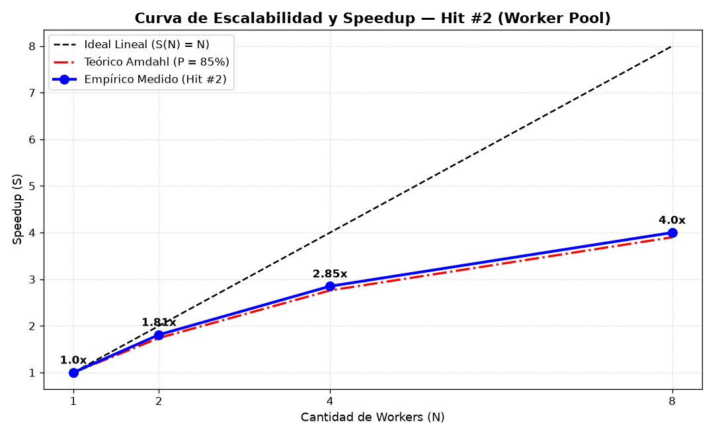
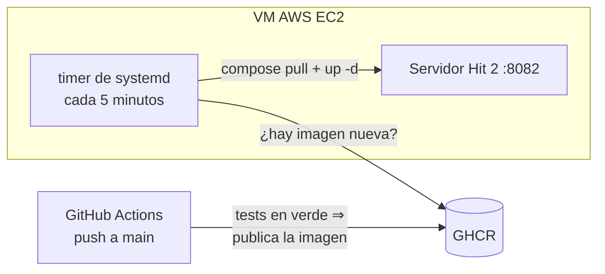

# Hit 2 — Concurrencia, Pool de Workers y Exclusión Mutua

El servidor HTTP de tareas remotas del [Hit 1](../hit1/), extendido con **concurrencia multihilo**, **pool de workers configurable**, **cola de tareas con exclusión mutua (Mutex)** y **relojes lógicos de Lamport [LAM78]**.

Incluye mediciones reales de throughput con 1, 2, 4 y 8 workers y su análisis con la **Ley de Amdahl [AMD67]**.

---

## 1. Arquitectura y Componentes del Hit #2

```
                       +-------------------------------------------------------+
                       |               Servidor FastAPI / Uvicorn              |
+------------------+   |                                                       |   +-----------------------+
|  Cliente HTTP A  |---> [Middleware Lamport Clock]                             |---> [Worker 1 (Docker)]   |
| (X-Lamport-Clock)|   |  ts_req = max(L_local, L_client) + 1                  |   +-----------------------+
+------------------+   |                                                       |
                       |  +-------------------------------------------------+  |   +-----------------------+
+------------------+   |  | Cola de Tareas con Exclusión Mutua (Mutex)    |  |---> [Worker 2 (Docker)]   |
|  Cliente HTTP B  |--->  | Protected by threading.Lock()                   |  |   +-----------------------+
| (X-Lamport-Clock)|   |  | Ordenada por Timestamp de Lamport (Min-Heap)    |  |
+------------------+   |  +-------------------------------------------------+  |   +-----------------------+
                       |                          |                            |---> [Worker N (Docker)]   |
                       |                 [Worker Pool Dispatcher]              |   +-----------------------+
                       +-------------------------------------------------------+
```

### Componentes Principales

1. **Reloj Lógico de Lamport (`app/lamport.py`)**:
   - Mantiene un contador interno thread-safe.
   - Aplica el algoritmo de Lamport en cada recepción de solicitud HTTP (`X-Lamport-Clock`):
     $$L_{servidor} = \max(L_{servidor}, L_{cliente}) + 1$$
   - Incrementa el reloj al enviar las respuestas.

2. **Pool de Workers y Cola Protegida (`app/pool.py`)**:
   - **Límite máximo configurable**: definido por `TP2_WORKERS_MAX` (por defecto `4`).
   - **Exclusión Mutua**: Toda operación sobre la cola (`encolar`, `despachar`, `liberar worker`) requiere la adquisición de un **Mutex interno** (`threading.Lock()`), garantizando cero condiciones de carrera (*race conditions*).
   - **Ordenamiento lógico**: La cola utiliza una min-heap donde las tareas se ordenan por el timestamp de Lamport **del cliente** (`X-Lamport-Clock` del pedido, el del evento de envío). Ante igualdad de timestamp, se aplica FIFO. Si se ordenara por el reloj del servidor al recibir, como ese crece con cada llegada, el orden sería el de llegada y el reloj no aportaría nada.

3. **Cliente con Reloj Lamport (`cliente/cliente.py`)**:
   - Cliente Python que incrementa su timestamp en cada envío y sincroniza su reloj local con la respuesta del servidor.

4. **Script de Benchmark y Análisis (`cliente/benchmark.py`)**:
   - Realiza pruebas de throughput (tareas completadas por minuto) para 1, 2, 4 y 8 workers.
   - Genera informe numérico y gráfico comparativo de escalabilidad (`mediciones/escalabilidad.png`).

---

## 2. Cómo Ejecutar

### Requisitos
- Docker y Docker Compose v2.
- Python 3.10+ (para ejecutar el cliente y el benchmark).

### Paso 1: Configurar e Iniciar Servidor
```bash
cd hit2
cp .env.example .env
# Configurar variables en .env (por ejemplo TP2_WORKERS_MAX=4)
docker compose up --build -d --wait
```

### Paso 2: Verificar Estado (/health)
```bash
curl -s http://localhost:8080/health
```

Respuesta esperada:
```json
{
  "codigo": 200,
  "contenido": {
    "servidor": "ok",
    "docker": "ok",
    "pool": {
      "workers_activos": 0,
      "workers_max": 4,
      "tareas_encoladas": 0
    },
    "lamport_ts": 1
  }
}
```

### Paso 3: Correr los Tests Unitarios
```bash
cd hit2/servidor
python3 -m pytest -v -m "not integracion"
(cd ../tarea && python3 -m pytest -v)
./tests/integracion.sh             # integración con Docker real
```

### Paso 4: Medir el throughput con 1, 2, 4 y 8 workers
```bash
cd hit2
cp .env.example .env        # completar, con el token de Docker Hub de sólo lectura
pip install matplotlib
python3 cliente/benchmark.py
```
Para cada N, el script reinicia el servidor con `TP2_WORKERS_MAX=N`, le manda 32 tareas a la vez
(la cola nunca se vacía), repite la medición 3 veces y guarda la tabla en
`mediciones/resultados_benchmark.json` y la curva en `mediciones/escalabilidad.png`.

---

## 3. Mediciones de Throughput y Análisis de Escalabilidad

Medido con `cliente/benchmark.py` (Paso 4): para cada $N$ se reinició el servidor con
`TP2_WORKERS_MAX=N` y se le mandaron **32 tareas a la vez** (sumas), **3 repeticiones** por $N$.
Todo en una misma máquina: AMD Ryzen 5 3600 (6 núcleos / 12 hilos), 31 GB de RAM, Docker 29.8,
Linux 7.2. Los datos crudos están en [`mediciones/resultados_benchmark.json`](mediciones/resultados_benchmark.json).

### Tabla de resultados

| Workers ($N$) | Tiempo para 32 tareas (prom. ± desvío) | Throughput (tareas/min) | Latencia media por tarea | Speedup medido | Amdahl ajustada ($P = 0{,}937$) | Ideal |
|---|---|---|---|---|---|---|
| 1 | 26,67 s ± 2,66 | **72** | 14,4 s | **1,00x** | 1,00x | 1x |
| 2 | 15,02 s ± 2,81 | **128** | 7,7 s | **1,78x** | 1,88x | 2x |
| 4 | 7,32 s ± 0,25 | **262** | 4,1 s | **3,64x** | 3,36x | 4x |
| 8 | 4,88 s ± 0,12 | **393** | 3,0 s | **5,46x** | 5,55x | 8x |



- Con 1 worker cada tarea cuesta **~0,83 s** (26,67 s / 32): casi todo es el ciclo de vida del
  contenedor (crear, arrancar, esperar su `/health`, borrarlo). La suma en sí tarda microsegundos.
- La **latencia media** cae de 14,4 s a 3,0 s: con pocos workers, la mayor parte del tiempo de
  cada pedido es **espera en la cola**.
- El speedup **no es lineal**: de 4 a 8 workers el throughput sube un 50 %, no un 100 %.

---

## 4. Análisis de la Ley de Amdahl [AMD67]

$$S(N) = \frac{1}{(1 - P) + \frac{P}{N}}$$

$P$ es la fracción del trabajo que se puede hacer en paralelo y $1 - P$ la que queda serializada.
En vez de suponer $P$, el benchmark la **ajusta a los speedups medidos** (mínimos cuadrados):
**$P \approx 0{,}937$**, es decir, ~6 % del trabajo por tarea queda serializado. La curva ajustada
predice 5,55x para 8 workers y se midió 5,46x.

Con ese $P$, el techo teórico es:

$$\lim_{N \to \infty} S(N) = \frac{1}{1 - 0{,}937} \approx 15{,}9\text{x}$$

aunque, por lo que muestra la sección 5, en esta máquina se llegaría antes a saturar la CPU.

Qué queda serializado ($1 - P$):
1. **El daemon de Docker**: crear, arrancar y borrar contenedores pasa por un único `dockerd`, que
   serializa parte de ese trabajo con locks internos (red, cgroups, capas).
2. **La sección crítica de la cola**: encolar y despachar bajo el mutex del pool (es mínima: sólo
   operaciones sobre la heap).
3. **El servidor HTTP**: recibir, validar y responder cada pedido.

---

## 5. Cuellos de Botella en Recursos Compartidos (Single-Host)

**Lo que se midió** durante el benchmark (muestras con `top` cada ~3 s, agrupadas por la cantidad de
contenedores tarea corriendo en ese momento; el uso de un proceso es sobre un núcleo, puede pasar
del 100 %):

| Contenedores tarea a la vez | CPU total de la máquina | `dockerd` | `containerd` + shims |
|---|---|---|---|
| 1 | 18 % | 11 % | 5 % |
| 2 | 29 % | 29 % | 15 % |
| 3–4 | 52 % | 59 % | 28 % |
| 5–8 | 79 % | 93 % | 46 % |

El uso de CPU de `dockerd` crece con la concurrencia y con 8 workers ya ocupa casi un núcleo
entero: el daemon es el primer cuello de botella. Además, la CPU total llega a ~80 %, porque cada
tarea arranca un contenedor nuevo con su propio intérprete de Python. (Con 8 workers la fase dura
pocos segundos y hay pocas muestras: el número es orientativo.)

Al ejecutar tanto el cliente, el servidor FastAPI y todos los contenedores de workers en un solo equipo host, los siguientes recursos compartidos se convierten en potenciales cuellos de botella:

### 1. Daemon de Docker (`/var/run/docker.sock`)
- **Problema**: El daemon de Docker utiliza locks internos para la asignación de namespaces, cgroups y controladores veth de red. Crear $N$ contenedores simultáneamente genera contención en la API del socket de Docker.
- **Identificación/Medición**: Se mide observando latencias en la llamada a `containers.create()` del SDK de Docker, o inspeccionando los eventos de Docker con `docker events`.

### 2. Red de Docker (Bridge `tp2-tareas`) y Socket IPC
- **Problema**: La creación rápida de interfaces virtuales de red (`veth`) e asignación de direcciones IP en la subred de Docker satura la pila de red del kernel Linux / WSL2.
- **Identificación/Medición**: Monitoreo de uso de red y estado de sockets con `ip link` / `netstat -s` / `ifconfig`.

### 3. CPU (Scheduler del SO & Context Switches)
- **Problema**: Cada contenedor Docker añade sobrecarga de aislamiento (namespaces, cgroups, procesos uvicorn/gunicorn internos de la tarea). Si el número de workers supera los núcleos físicos de CPU del host, se produce *thrashing* por cambios de contexto.
- **Identificación/Medición**: Herramientas como `htop`, `top`, `mpstat -P ALL 1`.

### 4. I/O de Disco (Capas de Overlay2 y Logs)
- **Problema**: El montaje de la capa de almacenamiento `overlay2` y la escritura de logs en disco (`logs/servidor.log` y stdout de contenedores) compiten por el ancho de banda del disco I/O.
- **Identificación/Medición**: `iostat -xz 1` o `iotop` para detectar un elevado `%util` en el dispositivo de almacenamiento.

### 5. Memoria RAM
- **Problema**: Cada contenedor Docker activo consume un *working set* mínimo de memoria RAM (Python runtime ~30-50MB por worker).
- **Identificación/Medición**: `docker stats` y `free -m`.

---

## 6. Decisiones de Diseño

### Exclusión mutua con un mutex local, no distribuido

El enunciado sugiere un mutex distribuido o Ricart-Agrawala [RIC81]. Usamos un `threading.Lock`, y la razón es qué hay que proteger:

- **Qué se protege**: la cola de tareas y el contador de workers activos. Los dos viven en la memoria de **un único proceso**, el servidor.
- **Quiénes compiten**: hilos de ese mismo proceso. Uno por cada pedido HTTP que encola y uno por cada worker que termina y despacha la tarea siguiente.
- **Por qué alcanza un lock local**: todos los que pueden tocar la cola comparten memoria, así que comparten el lock. Un mutex distribuido resuelve otro problema: procesos en máquinas distintas, sin memoria compartida, que se ponen de acuerdo por mensajes. Acá no hay un segundo proceso que vea la cola; usarlo sumaría mensajes de red y casos de falla sin proteger nada más.
- **Visto desde afuera, es el algoritmo centralizado** de exclusión mutua [TAN17, cap. 6]: los clientes piden un recurso (un worker), un coordinador (el servidor) encola los pedidos y lo concede cuando se libera uno. El mutex local protege el estado interno de ese coordinador.
- **Cuándo dejaría de alcanzar**: con dos o más instancias del servidor compartiendo una misma cola. Cada proceso tendría su propio lock, que no excluye al del otro. Haría falta un lock en un servicio común a todas (por ejemplo Redis) o Ricart-Agrawala entre las instancias, que ordena los pedidos de entrada a la sección crítica con timestamps de Lamport como los que ya viajan en los mensajes. En el [Hit 3](../hit3/) hay varias instancias, pero no comparten cola: cada tarea la sigue su nodo de entrada y el coordinador sólo decide a qué nodo va.

La sección crítica es corta: operaciones sobre la heap y el contador. El contenedor se ejecuta **fuera** del lock y el pedido espera el resultado con un `Future`, así que una tarea lenta no frena a las demás.

### Pool: un hilo por tarea en curso, con tope

- No hay $N$ hilos fijos esperando trabajo. Cuando hay un lugar libre, el pool lanza un hilo para esa tarea; el contador de workers activos, que sólo se toca con el mutex tomado, garantiza que nunca corran más de `TP2_WORKERS_MAX` contenedores a la vez. Al terminar, ese mismo hilo despacha la tarea siguiente de la cola.
- **Hilos y no procesos**: el worker pasa casi todo su tiempo esperando al daemon de Docker y al contenedor (E/S), no usando CPU de Python, así que el GIL no limita.
- Cada tarea corre en **su propio contenedor**, que se crea y se borra como en el Hit 1.
- `TP2_WORKERS_MAX` se lee al arrancar: para cambiarlo hay que reiniciar el servidor, que es lo que hace el benchmark entre una medición y la siguiente.

### Relojes de Lamport

- El timestamp viaja en la cabecera `X-Lamport-Clock`, en el pedido y en la respuesta (que además lo repite en el cuerpo, `lamport_ts`). No va en el JSON del pedido para no cambiar el payload del Hit 1.
- El servidor incrementa su reloj **una sola vez por respuesta**: el valor de la cabecera y el del cuerpo son el mismo.
- **Limitación**: un pedido sin la cabecera entra con timestamp `0` y queda primero en la cola. El orden supone clientes que respetan el protocolo.

### Lo demás es el Hit 1

La validación del payload, el sobre de las respuestas, la lista blanca de imágenes, las credenciales del registry y el ciclo de vida del contenedor tarea no cambian: ver las decisiones del [Hit 1](../hit1/README.md#decisiones-de-diseño).

---

## 7. Despliegue

Público en **http://18.231.127.74:8082/health**, en la misma VM de AWS EC2 que el Hit 1 (`8081`) y el TP1 (`8080`), con 4 workers.



- En cada push a `main`, después de gitleaks y de los tests unitarios y de integración, el CI (`.github/workflows/ci.yml`) publica la imagen del servidor en GHCR (`ghcr.io/chimera-sdypp/sdypp_tp2-hit2`) con el `GITHUB_TOKEN` efímero del job.
- En la VM, un timer de systemd (`sdypp-tp2-hit2.timer`) hace `docker compose pull && up -d` cada 5 minutos, con el mismo candado (`flock`) que los timers de los otros hits. GitHub no tiene ninguna credencial de la VM.
- Después, el CI prueba lo desplegado: manda con el cliente una suma (`200`, con su `lamport_ts`) y una división por cero (`422`) a la URL pública.
- El paquete de GHCR tiene que ser **público**, porque la VM lo baja sin credenciales.

### Instalación en la VM:

```bash
scp -i clave.pem hit2/despliegue/instalar_vm.sh hit2/docker-compose.yml ubuntu@<IP>:
ssh -i clave.pem ubuntu@<IP>
# en la VM: crear ~/.env a partir de .env.example, con TP2_PUERTO=8082 y
#   TP2_IMAGEN=ghcr.io/chimera-sdypp/sdypp_tp2-hit2:latest; luego:
sudo bash instalar_vm.sh && rm ~/.env
```

