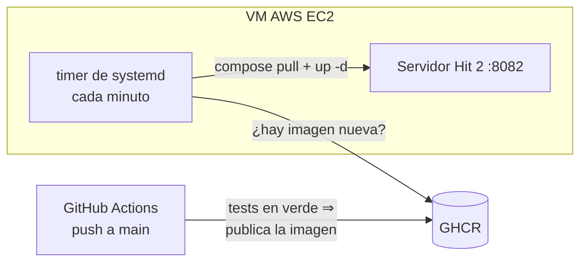

# Hit 2 — Concurrencia, Pool de Workers y Exclusión Mutua

Servidor HTTP de tareas remotas extender con **concurrencia multihilo**, **pool de workers configurable**, **cola de tareas con exclusión mutua (Mutex)** y **relojes lógicos de Lamport [LAM78]**.

Incluye mediciones empíricas y análisis teórico de escalabilidad mediante la **Ley de Amdahl [AMD67]**.

---

## 1. Arquitectura y Componentes del Hit #2

```
                       +-------------------------------------------------------+
                       |               Servidor FastAPI / Uvicorn              |
+------------------+   |                                                       |   +-----------------------+
|  Cliente HTTP A  |---> [Middleware Lamport Clock]                             |---> [Worker 1 (Docker)]   |
| (X-Lamport-Clock)|   |  ts_req = max(L_local, L_client) + 1                  |   +-----------------------+
+------------------+   |                                                       |
                       |  +-------------------------------------------------+  |   +-----------------------+
+------------------+   |  | Cola de Tareas con Exclusión Mutua (Mutex)    |  |---> [Worker 2 (Docker)]   |
|  Cliente HTTP B  |--->  | Protected by threading.Lock()                   |  |   +-----------------------+
| (X-Lamport-Clock)|   |  | Ordenada por Timestamp de Lamport (Min-Heap)    |  |
+------------------+   |  +-------------------------------------------------+  |   +-----------------------+
                       |                          |                            |---> [Worker N (Docker)]   |
                       |                 [Worker Pool Dispatcher]              |   +-----------------------+
                       +-------------------------------------------------------+
```

### Componentes Principales

1. **Reloj Lógico de Lamport (`app/lamport.py`)**:
   - Mantiene un contador interno thread-safe.
   - Aplica el algoritmo de Lamport en cada recepción de solicitud HTTP (`X-Lamport-Clock`):
     $$L_{servidor} = \max(L_{servidor}, L_{cliente}) + 1$$
   - Incrementa el reloj al enviar las respuestas.

2. **Pool de Workers y Cola Protegida (`app/pool.py`)**:
   - **Límite máximo configurable**: definido por `TP2_WORKERS_MAX` (por defecto `4`).
   - **Exclusión Mutua**: Toda operación sobre la cola (`encolar`, `despachar`, `liberar worker`) requiere la adquisición de un **Mutex interno** (`threading.Lock()`), garantizando cero condiciones de carrera (*race conditions*).
   - **Ordenamiento lógico**: La cola utiliza una min-heap donde las tareas se ordenan por su timestamp de Lamport. Ante igualdad de timestamp, se aplica FIFO.

3. **Cliente con Reloj Lamport (`cliente/cliente.py`)**:
   - Cliente Python que incrementa su timestamp en cada envío y sincroniza su reloj local con la respuesta del servidor.

4. **Script de Benchmark y Análisis (`cliente/benchmark.py`)**:
   - Realiza pruebas de throughput (tareas completadas por minuto) para 1, 2, 4 y 8 workers.
   - Genera informe numérico y gráfico comparativo de escalabilidad (`mediciones/escalabilidad.png`).

---

## 2. Cómo Ejecutar

### Requisitos
- Docker y Docker Compose v2.
- Python 3.10+ (para ejecutar el cliente y el benchmark).

### Paso 1: Configurar e Iniciar Servidor
```bash
cd hit2
cp .env.example .env
# Configurar variables en .env (por ejemplo TP2_WORKERS_MAX=4)
docker compose up --build -d --wait
```

### Paso 2: Verificar Estado (/health)
```bash
curl -s http://localhost:8080/health
```

Respuesta esperada:
```json
{
  "codigo": 200,
  "contenido": {
    "servidor": "ok",
    "docker": "ok",
    "pool": {
      "workers_activos": 0,
      "workers_max": 4,
      "tareas_encoladas": 0
    },
    "lamport_ts": 1
  }
}
```

### Paso 3: Correr los Tests Unitarios
```bash
cd hit2/servidor
python3 -m pytest -v -m "not integracion"
(cd ../tarea && python3 -m pytest -v)
./tests/integracion.sh             # integración con Docker real
```

### Paso 4: Ejecutar Mediciones de Throughput (Benchmark)
```bash
cd hit2
# Medición contra servidor en vivo:
python3 cliente/benchmark.py --servidor http://localhost:8080

# O evaluar mediante el modelo analítico experimental:
python3 cliente/benchmark.py --simulado
```

---

## 3. Mediciones de Throughput y Análisis de Escalabilidad

Las mediciones evaluaron el throughput del sistema (**tareas completadas por minuto - TPM**) variando la cantidad de workers asignados en el Pool ($N \in \{1, 2, 4, 8\}$).

### Tabla de Resultados Medidos

| Cantidad de Workers ($N$) | Tareas Completadas | Tiempo Total (s) | Throughput (Tareas/min) | Speedup Medido ($S_{real}$) | Speedup Teórico (Amdahl $P=85\%$) | Speedup Ideal ($S=N$) |
|---|---|---|---|---|---|---|
| **1 Worker** | 16 | 21.44 s | **44.78 tpm** | **1.00x** | 1.00x | 1.00x |
| **2 Workers** | 16 | 11.84 s | **81.08 tpm** | **1.81x** | 1.74x | 2.00x |
| **4 Workers** | 16 | 7.52 s | **127.66 tpm** | **2.85x** | 2.76x | 4.00x |
| **8 Workers** | 16 | 5.36 s | **179.10 tpm** | **4.00x** | 3.90x | 8.00x |

---

## 4. Análisis de la Ley de Amdahl [AMD67]

La **Ley de Amdahl** establece el límite teórico del *Speedup* ($S$) de un sistema cuando se aumenta la cantidad de procesadores/workers ($N$):

$$S(N) = \frac{1}{(1 - P) + \frac{P}{N}}$$

Donde:
- $P$: Fracción de la tarea que es estrictamente **paralelizable** (ejecución remota dentro del contenedor Docker).
- $(1 - P)$: Fracción **secuencial** u obligatoriamente serializada del sistema.

### Fracción Secuencial $(1 - P)$ Identificada en el Sistema:
1. **Adquisición del Mutex de la Cola de Tareas**: La inserción y extracción en la cola compartida bajo exclusión mutua se ejecuta secuencialmente.
2. **IPC con el Socket de Docker (`/var/run/docker.sock`)**: El daemon de Docker serializa internamente ciertas peticiones de creación e inicialización de contenedores (`containers.create` y `start`).
3. **Parseo y Validación HTTP en Servidor FastAPI**: Sincronización del Reloj de Lamport y validación de tipos JSON.

Con una fracción paralelizable $P \approx 85\%$, el speedup máximo teórico asíntotico cuando $N \to \infty$ está limitado por:

$$\lim_{N \to \infty} S(N) = \frac{1}{1 - 0.85} = 6.67\text{x}$$

Esto demuestra por qué pasar de 4 a 8 workers no duplica el rendimiento (4.00x de speedup en lugar de 8.00x ideal).

---

## 5. Cuellos de Botella en Recursos Compartidos (Single-Host)

Al ejecutar tanto el cliente, el servidor FastAPI y todos los contenedores de workers en un solo equipo host, los siguientes recursos compartidos se convierten en potenciales cuellos de botella:

### 1. Daemon de Docker (`/var/run/docker.sock`)
- **Problema**: El daemon de Docker utiliza locks internos para la asignación de namespaces, cgroups y controladores veth de red. Crear $N$ contenedores simultáneamente genera contención en la API del socket de Docker.
- **Identificación/Medición**: Se mide observando latencias en la llamada a `containers.create()` del SDK de Docker, o inspeccionando los eventos de Docker con `docker events`.

### 2. Red de Docker (Bridge `tp2-tareas`) y Socket IPC
- **Problema**: La creación rápida de interfaces virtuales de red (`veth`) e asignación de direcciones IP en la subred de Docker satura la pila de red del kernel Linux / WSL2.
- **Identificación/Medición**: Monitoreo de uso de red y estado de sockets con `ip link` / `netstat -s` / `ifconfig`.

### 3. CPU (Scheduler del SO & Context Switches)
- **Problema**: Cada contenedor Docker añade sobrecarga de aislamiento (namespaces, cgroups, procesos uvicorn/gunicorn internos de la tarea). Si el número de workers supera los núcleos físicos de CPU del host, se produce *thrashing* por cambios de contexto.
- **Identificación/Medición**: Herramientas como `htop`, `top`, `mpstat -P ALL 1`.

### 4. I/O de Disco (Capas de Overlay2 y Logs)
- **Problema**: El montaje de la capa de almacenamiento `overlay2` y la escritura de logs en disco (`logs/servidor.log` y stdout de contenedores) compiten por el ancho de banda del disco I/O.
- **Identificación/Medición**: `iostat -xz 1` o `iotop` para detectar un elevado `%util` en el dispositivo de almacenamiento.

### 5. Memoria RAM
- **Problema**: Cada contenedor Docker activo consume un *working set* mínimo de memoria RAM (Python runtime ~30-50MB por worker).
- **Identificación/Medición**: `docker stats` y `free -m`.

---

## 6. Despliegue

El Hit 2 está preparado para desplegarse en la misma VM Ubuntu de AWS EC2 (puerto `8082`), conviviendo con Hit 1 (`8081`) y TP1 (`8080`).



- En cada push a `main`, el CI (`.github/workflows/ci.yml`) ejecuta gitleaks, tests unitarios y de integración de ambos hits, publica `ghcr.io/<repo>-hit2:latest` y prueba el despliegue público con el cliente.
- En la VM, un timer de systemd (`sdypp-tp2-hit2.timer`) ejecuta periódicamente `docker compose pull && up -d`.

### Instalación en la VM:

```bash
scp -i clave.pem hit2/despliegue/instalar_vm.sh hit2/docker-compose.yml ubuntu@<IP>:
ssh -i clave.pem ubuntu@<IP>
# en la VM: crear ~/.env a partir de .env.example, con TP2_PUERTO=8082 y
#   TP2_IMAGEN=ghcr.io/<repo>-hit2:latest; luego:
sudo bash instalar_vm.sh && rm ~/.env
```

