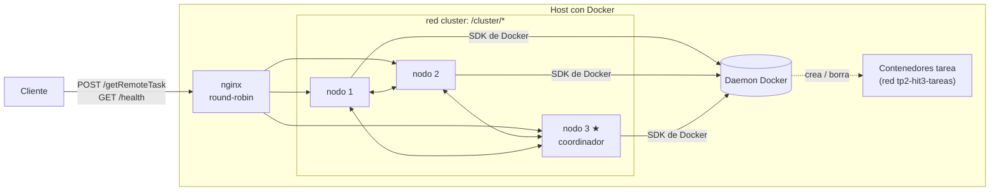
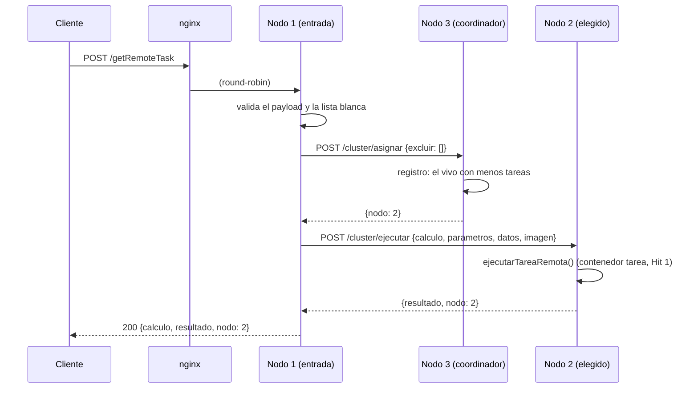
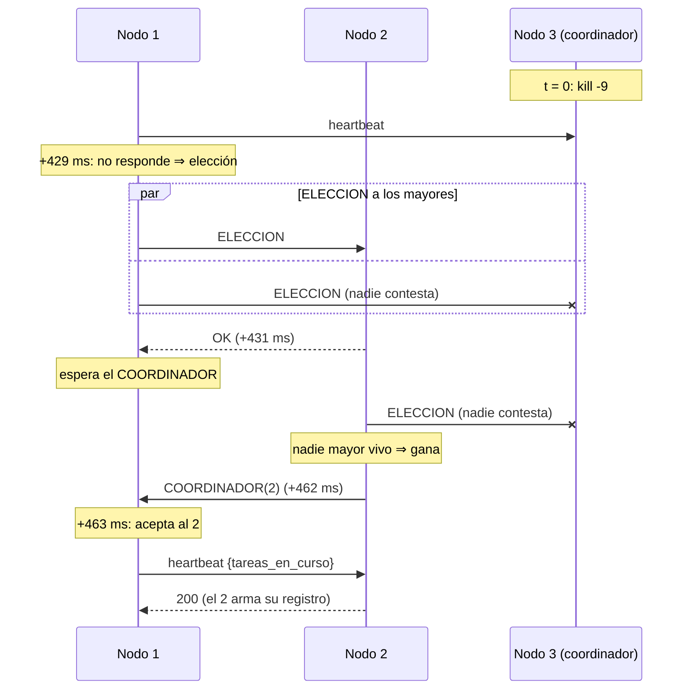
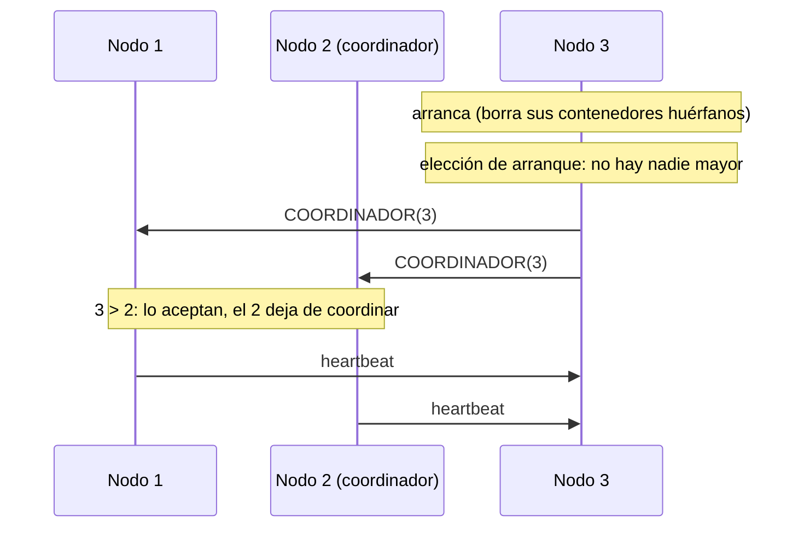
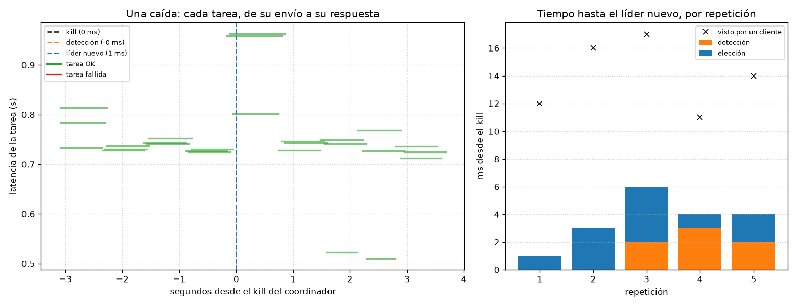
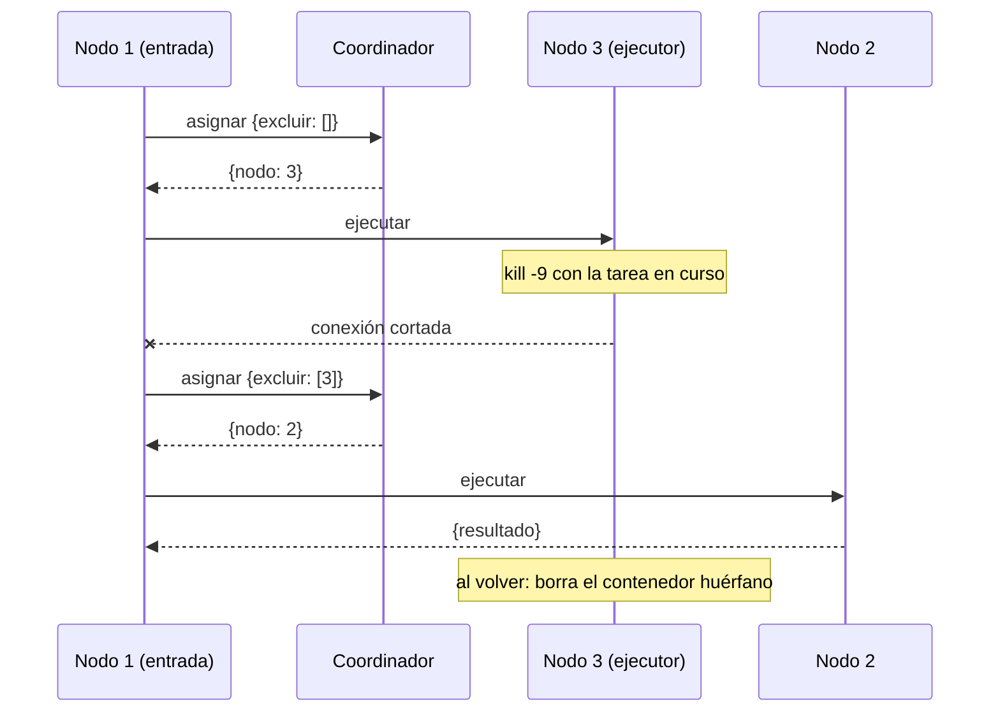

# Hit 3 — Coordinación y tolerancia a fallos

Tres instancias del servidor del [Hit 1](../hit1/) detrás de **nginx**. Los nodos eligen un
**coordinador** con el **algoritmo Bully** [GAR82]; el coordinador asigna cada tarea a un nodo
disponible y lleva el registro de estado de los nodos. Si se mata el proceso del coordinador,
los demás detectan la caída, eligen otro y las tareas siguen saliendo.

| Lo que pide el enunciado | Dónde |
|---|---|
| 2 o más instancias del servidor del Hit 1 detrás de un balanceador | [`docker-compose.yml`](docker-compose.yml) (3 nodos) y [`nginx/nginx.conf`](nginx/nginx.conf) |
| Elección de líder con Bully | [`servidor/app/bully.py`](servidor/app/bully.py) |
| El coordinador asigna tareas a los nodos disponibles | `Nodo.asignar()` en [`servidor/app/nodo.py`](servidor/app/nodo.py) |
| El coordinador mantiene el registro de estado de cada nodo | [`servidor/app/cluster.py`](servidor/app/cluster.py) |
| Si se cae el coordinador, otro lo detecta y toma el control | Heartbeats en `Bully.latir()`; [prueba](servidor/tests/test_integracion.py) y [medición](#tiempo-de-recuperación) |
| Diagrama de secuencia de una elección | [Elección de líder](#elección-de-líder-bully) |
| Tiempo de recuperación ante la caída del coordinador | [Tiempo de recuperación](#tiempo-de-recuperación) |
| Cómo se redistribuyen las tareas pendientes | [Redistribución de tareas](#redistribución-de-las-tareas-pendientes) |

## Cómo correrlo

Requisitos: Docker con Compose v2, Linux (o WSL2) y Python 3 para el cliente. Todo desde `hit3/`.

```bash
cd hit3
cp .env.example .env
# Completar en .env (igual que en el Hit 1):
#   DOCKER_GID=<salida de: stat -c %g /var/run/docker.sock>
#   TP2_IMAGENES_PERMITIDAS=cerberusdistribuido/tarea
#   TP2_REGISTRY_USUARIO=cerberusdistribuido
#   TP2_REGISTRY_TOKEN=<token de Docker Hub de sólo lectura>
docker compose up --build -d --wait
curl -s localhost:8080/health          # contesta alguno de los 3 nodos: dice quién es el coordinador
python3 cliente/cliente.py suma '{"a": 3, "b": 4}' --imagen cerberusdistribuido/tarea:1.0.0
```

La respuesta es la del Hit 1 más el nodo que ejecutó la tarea:

```json
{"codigo": 200, "contenido": {"calculo": "suma", "resultado": 7, "nodo": 2}}
```

### Simular la caída del coordinador

```bash
docker compose kill nodo3                  # SIGKILL al proceso del coordinador
curl -s localhost:8080/health              # ahora el coordinador es el 2
docker compose logs nodo1 nodo2 | grep bully   # la elección, mensaje por mensaje
docker compose up -d nodo3                 # vuelve y recupera el puesto (es el mayor)
```

### Tests

```bash
cd hit3/servidor
python3 -m venv .venv && source .venv/bin/activate
pip install -r requirements-dev.txt
python -m pytest                   # unitarios y de API (incluido Bully con una red en memoria): sin Docker
(cd ../tarea && python -m pytest)
./tests/integracion.sh             # levanta el cluster con Docker real, mata nodos, prueba y lo baja
```

La integración prueba, contra el cluster real: el reparto entre los 3 nodos, que `/cluster/*` no
se vea desde afuera, el **kill del coordinador** (se elige el 2, las tareas siguen, el 3 vuelve y
recupera el puesto) y el **kill de un ejecutor con una tarea en curso** (la tarea se reasigna y
termina bien; al volver, el nodo borra el contenedor tarea que le quedó huérfano).

### Medir el tiempo de recuperación

```bash
cd hit3 && pip install matplotlib   # con el cluster levantado
python3 cliente/caida_coordinador.py --nombre con_carga                 # 3 clientes mandando tareas
python3 cliente/caida_coordinador.py --nombre sin_carga --clientes 0    # sólo detecta el heartbeat
```

## Arquitectura



- Los **3 nodos** son el servidor del Hit 1 con la misma imagen; cambian `TP2_NODO_ID` y la lista
  de pares (`TP2_PARES`). **Todos son workers**: cualquiera ejecuta tareas como en el Hit 1.
- **Uno además es coordinador**: el de ID más alto que esté vivo. No toca Docker de otra forma;
  decide **qué nodo** ejecuta cada tarea y lleva el **registro de nodos**.
- **nginx** reparte los pedidos de los clientes en round-robin, sin saber quién es el líder. Sólo
  publica `/getRemoteTask` y `/health`; `/cluster/*` es un `404` desde afuera. Los nodos no
  publican puertos.

Cada nodo cumple tres papeles:

| Papel | Qué hace |
|---|---|
| **Entrada** | nginx le pasó el pedido: lo valida (como el Hit 1), le pide al coordinador a qué nodo mandarlo, se lo reenvía y le contesta al cliente. **Es el dueño de la tarea hasta que termina.** |
| **Worker** | Ejecuta las tareas que le asignan: `ejecutarTareaRemota()` del Hit 1. |
| **Coordinador** (sólo uno) | Asigna tareas y mantiene el registro de nodos. |

### Flujo de una tarea



Si el coordinador asigna la tarea al mismo nodo de entrada, la ejecuta ahí sin reenviarla. Si
el coordinador es el nodo de entrada, asigna sin mandar mensajes.

### El registro de nodos

Cada nodo le manda al coordinador un **heartbeat** por segundo (`POST /cluster/heartbeat
{de, tareas_en_curso}`). Con eso el coordinador sabe, de cada nodo:

```json
"nodos": {"1": {"estado": "vivo",  "tareas_en_curso": 1, "ultimo_heartbeat_hace": 0.4},
          "2": {"estado": "vivo",  "tareas_en_curso": 0, "ultimo_heartbeat_hace": 0.9},
          "3": {"estado": "caido", "tareas_en_curso": 2, "ultimo_heartbeat_hace": 3.6}}
```

(lo muestra `/health` cuando contesta el coordinador). Un nodo sin heartbeat en 3 s está caído y
no recibe tareas. Para asignar, el coordinador elige **el vivo con menos tareas en curso** (empate:
al azar) y le suma la tarea en el momento, sin esperar al heartbeat: si no, todas las tareas que
llegan entre dos heartbeats irían al mismo nodo.

Es **estado blando**: se arma sólo con los heartbeats. Un coordinador nuevo no necesita recuperar
el registro del anterior: lo empieza con él mismo y los nodos que le aceptaron el anuncio, y los
heartbeats lo completan. Por eso no hay nada que replicar.

## Elección de líder (Bully)

**Regla:** gana el nodo vivo de ID más alto. Los mensajes van por HTTP entre los nodos:

| Mensaje | Quién lo manda | Significado |
|---|---|---|
| `ELECCION` (`POST /cluster/eleccion`) | Un nodo, a todos los de **ID mayor** | "No hay coordinador: ¿hay alguien más grande vivo?" |
| `OK` (el `200` de la respuesta) | El de ID mayor | "Sí, yo. Seguí esperando." Y arranca su propia elección |
| `COORDINADOR` (`POST /cluster/coordinador`) | El ganador, a **todos** | "Soy el nuevo coordinador" |

Cuándo un nodo convoca una elección:

- **Al arrancar**, siempre: si es el mayor, se queda con el puesto (el *bully*).
- **Si el heartbeat al coordinador falla** (no conecta o no contesta en 1 s), o si el que recibe el
  heartbeat contesta que no es coordinador (`409`).
- **Si el coordinador no contesta un pedido de asignación**: una tarea en curso detecta la caída
  antes que el heartbeat.
- Si después de un `OK` no llega el `COORDINADOR` en 3 s (el mayor también se cayó): repite.
- Si le llega un `COORDINADOR` de un nodo **menor**: lo rechaza (`409`) y convoca una elección,
  que gana él.

Las sospechas (heartbeat o asignación fallida) sólo convocan una elección **si el coordinador
sigue siendo el sospechado**: mientras el mensaje fallido iba y volvía pudo haber llegado el
anuncio de uno nuevo, y una segunda elección sólo dejaría al nodo sin coordinador un rato. Los
mensajes a varios nodos salen **en paralelo**, para no sumar los timeouts de los caídos.

### Diagrama de secuencia: se mata al coordinador

Una caída real (sin carga, [`mediciones/sin_carga_eleccion.log`](mediciones/sin_carga_eleccion.log)),
con los tiempos desde el `kill`:



```text
# kill del nodo 3 en t = 0 ms
  +429.2 ms  nodo1  bully | nodo 1: el coordinador 3 no responde ([Errno -2] Name or service not known)
  +429.3 ms  nodo1  bully | nodo 1 inicia elección (el coordinador 3 no responde) | ELECCION → [2, 3]
  +430.9 ms  nodo2  bully | nodo 2 recibió ELECCION de 1 | OK → 1
  +431.1 ms  nodo2  bully | nodo 2 inicia elección (ELECCION de 1) | ELECCION → [3]
  +453.5 ms  nodo1  bully | nodo 1 recibió OK de [2]: espera COORDINADOR
  +461.6 ms  nodo2  bully | nodo 2 es el nuevo COORDINADOR | COORDINADOR → [1, 3]
  +463.2 ms  nodo1  bully | nodo 1 acepta COORDINADOR 2
```

Los ~30 ms entre la `ELECCION` del 2 y su victoria son la espera a que el DNS de Docker diga que
`nodo3` ya no existe.

### Diagrama de secuencia: el coordinador vuelve



Desde `docker start` hasta que el 3 vuelve a coordinar pasan ~1 s, casi todo el arranque de
Python y uvicorn.

## Tiempo de recuperación

Medido con [`cliente/caida_coordinador.py`](cliente/caida_coordinador.py): 5 caídas del
coordinador por escenario. Cada vez se mata el proceso (`docker kill`, SIGKILL), se espera al
líder nuevo y se vuelve a levantar el nodo. Los instantes salen de los logs de los nodos con la
marca de tiempo de Docker, y el del kill de `docker inspect` (`FinishedAt`): todo con el mismo
reloj. Máquina: AMD Ryzen 7 5700G (8 núcleos / 16 hilos), 13 GB de RAM, Docker 29.8, Linux 7.2;
heartbeat cada 1 s.

| Escenario | Detección | Elección | **Líder nuevo** | Todos lo aceptan | Lo ve un cliente (nginx) | El 3 vuelve a coordinar |
|---|---|---|---|---|---|---|
| **Con carga** (3 clientes sin pausa) | 1 ms (0–3) | 2 ms (1–4) | **4 ms** (1–6) | 6 ms (4–8) | 14 ms (11–17) | 1,11 s (1,00–1,25) |
| **Sin carga** (sólo el heartbeat) | 599 ms (156–851) | 28 ms (23–34) | **627 ms** (185–885) | 629 ms (187–886) | 635 ms (195–889) | 1,02 s (1,01–1,04) |

Media (mínimo–máximo) en ms desde el kill. Datos en
[`mediciones/con_carga.json`](mediciones/con_carga.json) y
[`mediciones/sin_carga.json`](mediciones/sin_carga.json).



- **Casi todo el tiempo de recuperación es la detección.** La elección en sí cuesta unos pocos ms.
- **Con carga, la caída se detecta casi al instante**: cuando muere el proceso, el kernel cierra
  sus conexiones, y alguna tarea en curso (un reenvío al nodo 3 o un pedido de asignación) lo
  nota en el momento y convoca la elección.
- **Sin carga, la detecta el heartbeat**: la caída cae en cualquier punto del intervalo de 1 s,
  así que la detección va de 0 a ~1 s (media ~0,5 s). El peor caso es el **intervalo del
  heartbeat más su timeout** (1 s + 1 s) si el nodo se cuelga sin morir: un proceso muerto, en
  cambio, rechaza la conexión al instante (o su nombre deja de resolver).
- Bajar `TP2_INTERVALO_HEARTBEAT` acorta la detección sin carga a cambio de más mensajes:
  con N nodos son N−1 heartbeats por intervalo.
- **Lo que ve un cliente**: unos 10 ms después del líder nuevo, `/health` por nginx ya lo muestra.
  Para eso nginx corta a los 300 ms la conexión a un nodo muerto (`proxy_connect_timeout`; un nodo
  muerto no rechaza la conexión: su IP ya no existe) y prueba con otro.

## Redistribución de las tareas pendientes

La clave es que **cada tarea la sigue su nodo de entrada, no el coordinador**: el coordinador sólo
decide a quién va, y su registro se reconstruye solo. Por eso su caída no pierde tareas.

| Qué se cae | Qué pasa con las tareas pendientes |
|---|---|
| **El coordinador**, con tareas **pidiendo asignación** | El nodo de entrada no consigue asignación: convoca la elección y **reintenta con el coordinador nuevo** (hasta `TP2_TIMEOUT_ASIGNACION`, 10 s; si no hay coordinador para entonces: `503 CLUSTER_NO_DISPONIBLE`). |
| **El coordinador**, con tareas **ejecutándose en otros nodos** | No les pasa nada: el coordinador no está en ese camino. El ejecutor le contesta al nodo de entrada. |
| **Un nodo que ejecutaba una tarea** (coordinador o no) | El nodo de entrada ve la conexión cortada, pide **otra asignación excluyendo ese nodo** y la tarea **se re-ejecuta en otro**. Se puede porque las tareas son cálculos sin efectos secundarios. |
| **Un nodo que ejecutaba una tarea, pero no contesta a tiempo** | No se re-ejecuta (puede seguir corriendo): `504 TAREA_SIN_RESPUESTA`. |
| **El nodo de entrada** | Esa tarea **se pierde**: nginx ya le había mandado el pedido y no lo reintenta en otro nodo (un `POST` no es idempotente), y el cliente recibe `502 NODO_NO_DISPONIBLE`. El cliente puede reintentar: los pedidos nuevos ya van a los nodos vivos. |
| **Cualquier nodo, con un contenedor tarea corriendo** | El `finally` del Hit 1 no llega a correr y el contenedor queda. Cada contenedor lleva la etiqueta `tp2.hit3.nodo=<id>`, y **al volver, el nodo borra los suyos**. |

En la medición con carga, las 5 caídas afectaron a 23 tareas (las que estaban en vuelo o se
mandaron entre el kill y el líder nuevo): **16 terminaron bien**, 4 de ellas **reasignadas**
desde el nodo caído (tardaron hasta ~1,1 s en vez de ~0,74 s), y **7 fallaron con `502`**: las que
tenían al nodo caído como nodo de entrada. Es el límite de este diseño; cerrarlo requiere que el
cliente reintente, o que la tarea no dependa de un único nodo de entrada (una cola replicada).



## Decisiones de diseño

- **El coordinador no ejecuta las tareas de los demás ni las encola**: sólo decide a quién van. Si
  pasaran todas por él, sería un cuello de botella y su caída perdería las tareas encoladas.
- **Bully sobre HTTP**, con los mismos sobres JSON del Hit 1. Los mensajes del cluster se validan
  en modo estricto, y `/cluster/ejecutar` vuelve a mirar la lista blanca de imágenes: no confía en
  que el pedido venga de un nodo.
- **El algoritmo está separado del transporte**: `Bully` recibe los mensajes por métodos y manda
  los suyos con una función inyectable. Los tests unitarios conectan 3 instancias en memoria y
  prueban las caídas y los casos borde sin red ni hilos.
- **nginx con `resolve`**: vuelve a resolver los nombres de los nodos cada 2 s. Sin eso, nginx
  seguiría usando la IP vieja de un nodo que volvió con otra, y nunca le mandaría pedidos.

### Limitaciones

- **Los 3 nodos corren en el mismo host.** Se simula la caída de un nodo, no la de una máquina:
  si se cae el host, se cae todo. Repartirlos en varias máquinas no cambia el código (los pares
  son URLs), sí el despliegue.
- **Los mensajes entre nodos no se autentican.** Los protege que la red `cluster` es interna y
  nginx no publica `/cluster/*`. En una red compartida haría falta un secreto compartido o mTLS.
- **Particiones de red**: Bully supone que un nodo que no contesta está muerto. Si la red se
  partiera, cada lado elegiría su coordinador (*split brain*). En un solo host no pasa.
- **El reparto es aproximado**: el coordinador corrige su cuenta de tareas con cada heartbeat
  (1 s), así que en ráfagas puede asignar con datos un poco viejos.
- **La tarea del nodo de entrada que se cae se pierde** (ver arriba).

## Configuración

Variables de entorno de cada nodo, además de las del Hit 1 (ver [`.env.example`](.env.example)):

| Variable | Default | Qué es |
|---|---|---|
| `TP2_NODO_ID` | `1` | ID del nodo (Bully: gana el mayor) |
| `TP2_PARES` | (ninguno) | Los otros nodos: `2=http://nodo2:8080,3=http://nodo3:8080` |
| `TP2_INTERVALO_HEARTBEAT` | `1` s | Cada cuánto cada nodo le avisa al coordinador que está vivo |
| `TP2_TIMEOUT_MENSAJE` | `1` s | Cuánto se espera un heartbeat, una `ELECCION` o un `COORDINADOR` |
| `TP2_VENCIMIENTO_NODO` | `3` s | Sin heartbeat en ese tiempo, el coordinador da al nodo por caído |
| `TP2_TIMEOUT_COORDINADOR` | `3` s | Después de un `OK`, cuánto se espera el `COORDINADOR` |
| `TP2_TIMEOUT_ASIGNACION` | `10` s | Cuánto espera una tarea a que haya coordinador |

El resto (credenciales del registry, lista blanca, validación, logs) es el del Hit 1: ver su
[README](../hit1/README.md) y el [contrato](contrato.md) de este hit.

## Referencias

- [GAR82] H. Garcia-Molina, "Elections in a Distributed Computing System", *IEEE Transactions on
  Computers*, vol. C-31, no. 1, pp. 48–59, 1982.
- [NGINX] nginx, módulo `ngx_http_upstream_module` (`server ... resolve`, `proxy_next_upstream`).
